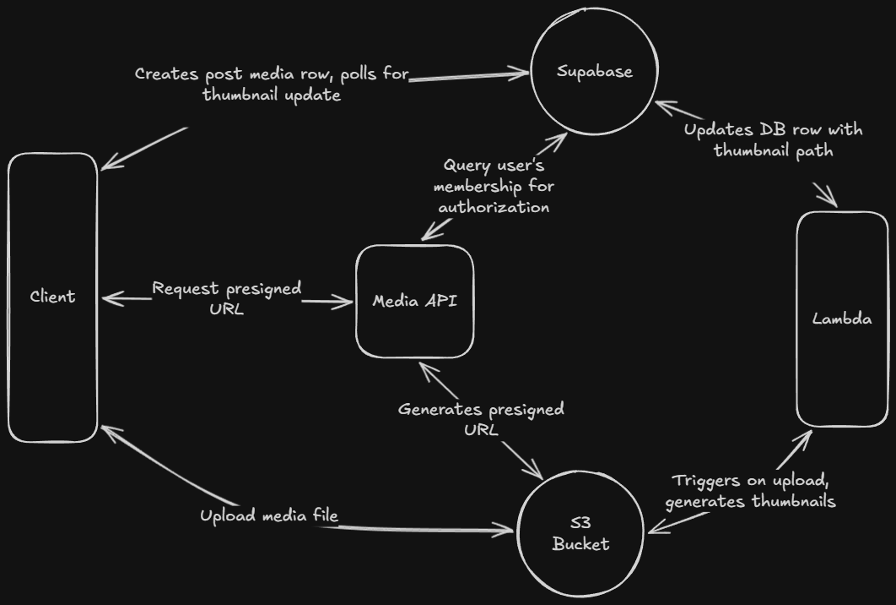

# Plink

Plink is a personal project I built for my friend group to make sharing hangout memories easier. Built and deployed with Expo, DB and storage is split into two services: Supabase to handle auth and database; S3 to handle private media and user profile storage and uploads through an API hosted on App Runner.

## Tech Stack

- **Mobile:** Expo, React Native, TypeScript, React Navigation, Unistyles
- **Backend:** Supabase (Auth, PostgreSQL), Express.js (media API)
- **Infrastructure:** AWS S3, Lambda, AppRunner, GitHub Actions, EAS Build
- **Monitoring:** Sentry, PostHog, CloudWatch

## Features

- Custom Express API deployed on AWS App Runner for media uploads to S3
  - Presigned S3 URLs with JWT authentication and membership-based authorization through Supabase
- Staged batch uploads with per-file progress, compression, and partial failure recovery
  - Thumbnails generated on upload using Lambda: images with _sharp_, videos with _FFmpeg_
  - Polling-based subscription refreshes UI once server-side thumbnail generation completes
- Resolver layer between database and UI handles signed URL resolution and image prefetching
- Sentry error boundaries + PostHog event tracking and session replay in production

## Media Upload Flow



## Project Structure

```
backend/
  media-service/    # Dockerized Express.js API

src/                # Expo App
  components/       # Reusable UI

  features/         # Feature Modules (contains feature-specific components, hooks, screens)
    auth/           # Sign in/up, profile completion
    parties/        # Party list, party detail, invite flow
    links/          # Link detail, media viewer, camera, uploads
    activity/       # Activity feed, push notifications
    profile/        # Profile viewing and editing

  lib/
    models/         # TypeScript type definitions for Supabase types/UI-facing types
    resolvers/      # Resolves DB path rows with image/video URLs
    supabase/       # Queries and DB types
    media-service/  # S3 API client with signed URL caching
    telemetry/      # Sentry monitoring, PostHog analytics, logger

  navigation/       # Nested navigation stack/tabs config
  providers/        # Auth, ActiveLink, Dialog, Query contexts
  styles/           # Unistyles themes
```

## Running Locally

This app requires a Supabase project and a media service backend connected to AWS S3. A dev build is needed for native camera and video features.

```bash
# Mobile app
npm install
npx expo prebuild
npm run ios # or npm run android

# Media service in /backend/media-service/
docker-compose up
```

Used env variables for Expo app:

```env
EXPO_PUBLIC_SUPABASE_URL=
EXPO_PUBLIC_SUPABASE_ANON_KEY=
EXPO_PUBLIC_MEDIA_SERVICE_URL=
SENTRY_DSN=
POSTHOG_API_KEY=
```

Media service backend:

```env
AWS_REGION=
AWS_ACCESS_KEY_ID=
AWS_SECRET_ACCESS_KEY=
S3_BUCKET=
SUPABASE_JWT_SECRET=
```
